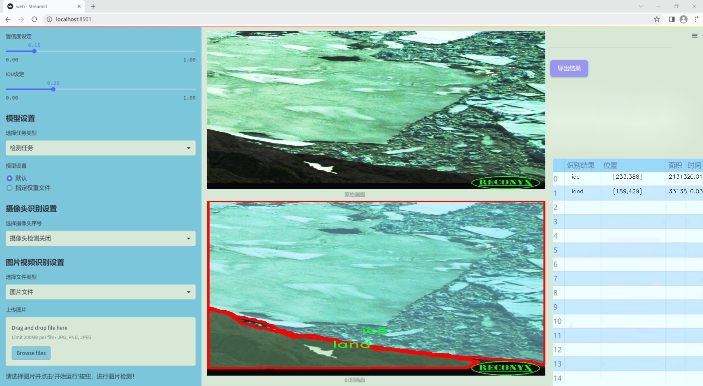
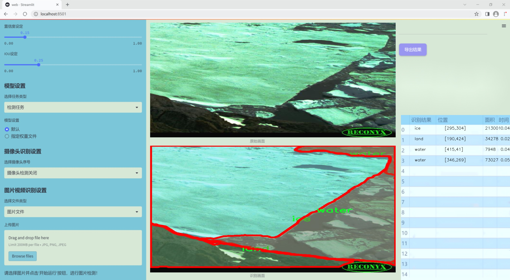
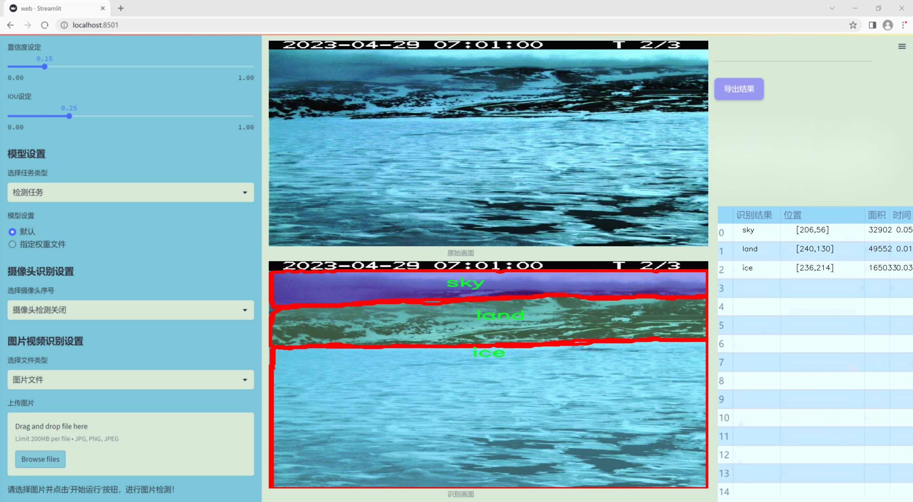
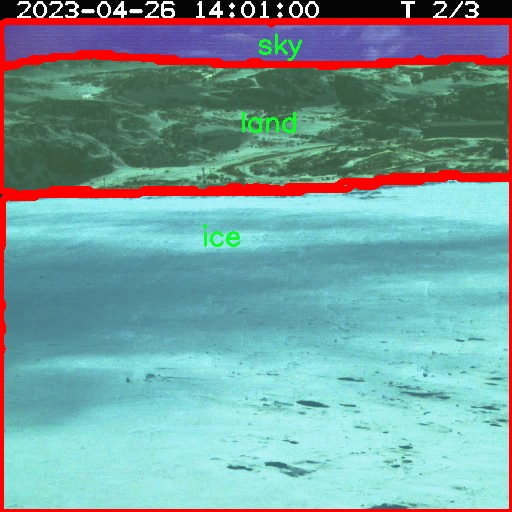
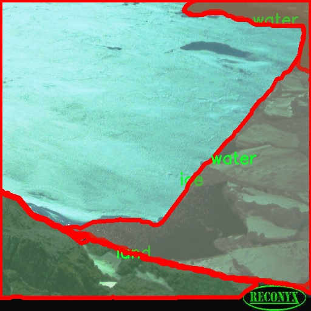
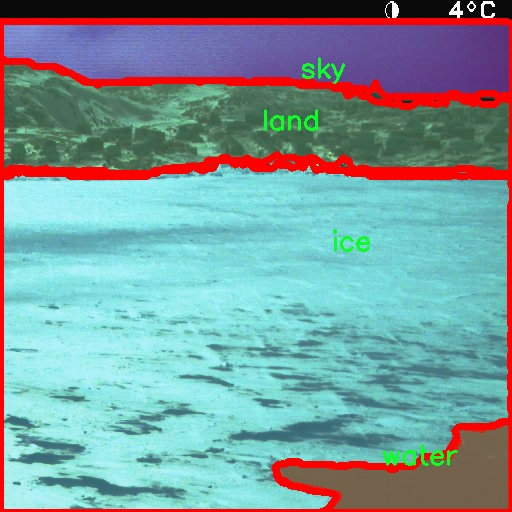
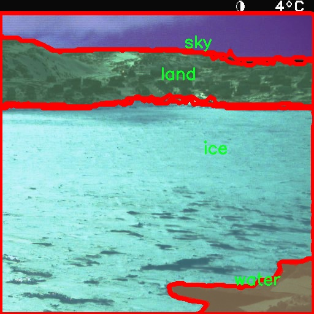

### 1.背景意义

研究背景与意义

随着无人机技术的迅猛发展，基于无人机的自然场景分割系统在环境监测、农业管理、城市规划等领域展现出了广泛的应用潜力。自然场景分割的核心任务是从复杂的图像中准确识别和分离不同的地物类别，如冰、土地、天空和水体等。这一过程不仅对提高无人机的自主导航能力至关重要，也为后续的数据分析和决策提供了重要支持。

近年来，深度学习技术的快速进步为图像分割任务带来了新的机遇。其中，YOLO（You Only Look Once）系列模型因其高效的实时检测能力而受到广泛关注。YOLOv11作为该系列的最新版本，进一步提升了检测精度和速度，适用于动态变化的自然场景。然而，现有的YOLOv11模型在处理复杂自然场景时仍面临一些挑战，例如背景干扰、光照变化以及物体重叠等问题。因此，改进YOLOv11以增强其在自然场景分割中的表现，具有重要的研究价值和实际意义。

本研究旨在基于改进的YOLOv11模型，构建一个高效的无人机自然场景分割系统。我们将利用一个包含4000张随机图像的数据集，该数据集涵盖了冰、土地、天空和水体四个类别。这些图像经过精心标注，能够为模型的训练和评估提供坚实的基础。通过对数据集的深入分析和处理，我们希望能够提升模型在不同自然环境下的分割精度，从而为无人机在复杂场景中的应用提供更为可靠的技术支持。

综上所述，基于改进YOLOv11的无人机自然场景分割系统不仅具有重要的理论研究价值，也将为实际应用提供切实可行的解决方案，推动无人机技术在各个领域的进一步发展。

### 2.视频效果

[2.1 视频效果](https://www.bilibili.com/video/BV1eVkgYAEQ9/)

### 3.图片效果







##### [项目涉及的源码数据来源链接](https://kdocs.cn/l/cszuIiCKVNis)**

注意：本项目提供训练的数据集和训练教程,由于版本持续更新,暂不提供权重文件（best.pt）,请按照6.训练教程进行训练后实现上图演示的效果。

### 4.数据集信息

##### 4.1 本项目数据集类别数＆类别名

nc: 4
names: ['ice', 'land', 'sky', 'water']


该项目为【图像分割】数据集，请在【训练教程和Web端加载模型教程（第三步）】这一步的时候按照【图像分割】部分的教程来训练

##### 4.2 本项目数据集信息介绍

本项目数据集信息介绍

本项目所使用的数据集旨在支持改进YOLOv11的无人机自然场景分割系统，专注于自然环境中不同元素的识别与分割。数据集的主题为“随机图像”，通过收集和整理多样化的自然场景图像，确保模型在实际应用中具备更强的泛化能力和准确性。该数据集包含四个主要类别，分别为冰（ice）、陆地（land）、天空（sky）和水（water），这些类别涵盖了自然环境中常见的元素，为模型提供了丰富的训练素材。

在数据集的构建过程中，我们注重图像的多样性和代表性，确保每个类别的样本数量均衡，且涵盖不同的拍摄角度、光照条件和季节变化。这种多样性不仅增强了模型的鲁棒性，还提高了其在复杂场景下的分割精度。冰类图像可能包括冰川、冰面等，陆地类则涵盖森林、草地和山脉等自然地貌，天空类图像则可能是晴天、阴天及日出日落等不同状态，而水类则包括湖泊、河流和海洋等多种水体。

通过精心挑选和标注的图像，数据集为训练YOLOv11提供了坚实的基础，使其能够有效识别和分割这些自然元素。我们相信，经过充分训练的模型将能够在无人机应用中实现高效的场景理解，为环境监测、资源管理和灾害响应等领域提供有力支持。数据集的设计和实施将为后续的研究和应用奠定良好的基础，推动无人机技术在自然场景分析中的进一步发展。










### 5.全套项目环境部署视频教程（零基础手把手教学）

[5.1 所需软件PyCharm和Anaconda安装教程（第一步）](https://www.bilibili.com/video/BV1BoC1YCEKi/?spm_id_from=333.999.0.0&vd_source=bc9aec86d164b67a7004b996143742dc)


[5.2 安装Python虚拟环境创建和依赖库安装视频教程（第二步）](https://www.bilibili.com/video/BV1ZoC1YCEBw?spm_id_from=333.788.videopod.sections&vd_source=bc9aec86d164b67a7004b996143742dc)

### 6.改进YOLOv11训练教程和Web_UI前端加载模型教程（零基础手把手教学）

[6.1 改进YOLOv11训练教程和Web_UI前端加载模型教程（第三步）](https://www.bilibili.com/video/BV1BoC1YCEhR?spm_id_from=333.788.videopod.sections&vd_source=bc9aec86d164b67a7004b996143742dc)


按照上面的训练视频教程链接加载项目提供的数据集，运行train.py即可开始训练



     Epoch   gpu_mem       box       obj       cls    labels  img_size
     1/200     20.8G   0.01576   0.01955  0.007536        22      1280: 100%|██████████| 849/849 [14:42<00:00,  1.04s/it]
               Class     Images     Labels          P          R     mAP@.5 mAP@.5:.95: 100%|██████████| 213/213 [01:14<00:00,  2.87it/s]
                 all       3395      17314      0.994      0.957      0.0957      0.0843

     Epoch   gpu_mem       box       obj       cls    labels  img_size
     2/200     20.8G   0.01578   0.01923  0.007006        22      1280: 100%|██████████| 849/849 [14:44<00:00,  1.04s/it]
               Class     Images     Labels          P          R     mAP@.5 mAP@.5:.95: 100%|██████████| 213/213 [01:12<00:00,  2.95it/s]
                 all       3395      17314      0.996      0.956      0.0957      0.0845

     Epoch   gpu_mem       box       obj       cls    labels  img_size
     3/200     20.8G   0.01561    0.0191  0.006895        27      1280: 100%|██████████| 849/849 [10:56<00:00,  1.29it/s]
               Class     Images     Labels          P          R     mAP@.5 mAP@.5:.95: 100%|███████   | 187/213 [00:52<00:00,  4.04it/s]
                 all       3395      17314      0.996      0.957      0.0957      0.0845


###### [项目数据集下载链接](https://kdocs.cn/l/cszuIiCKVNis)

### 7.原始YOLOv11算法讲解


YOLO11 是 Ultralytics YOLO 系列的最新版本，结合了尖端的准确性、速度和效率，用于目标检测、分割、分类、定向边界框和姿态估计。与
YOLOv8 相比，它具有更少的参数和更好的结果，不难预见，YOLO11 在边缘设备上更高效、更快，将频繁出现在计算机视觉领域的最先进技术（SOTA）中。


**主要特点**

  * **增强的特征提取：**YOLO11 使用改进的主干和颈部架构来增强特征提取，以实现更精确的目标检测和复杂任务的性能。

  * **针对效率和速度优化：**精细的架构设计和优化的训练流程在保持准确性和性能之间最佳平衡的同时，提供更快的处理速度。

  * **更少的参数，更高的准确度：**YOLO11m 在 COCO 数据集上实现了比 YOLOv8m 更高的 mAP，参数减少了 22%，提高了计算效率，同时不牺牲准确度。

  * **跨环境的适应性：**YOLO11 可以无缝部署在边缘设备、云平台和配备 NVIDIA GPU 的系统上，确保最大的灵活性。

  * **支持广泛的任务范围：**YOLO11 支持各种计算机视觉任务，如目标检测、实例分割、图像分类、姿态估计和定向目标检测（OBB）。


### 8.200+种全套改进YOLOV11创新点原理讲解

#### 8.1 200+种全套改进YOLOV11创新点原理讲解大全

由于篇幅限制，每个创新点的具体原理讲解就不全部展开，具体见下列网址中的改进模块对应项目的技术原理博客网址【Blog】（创新点均为模块化搭建，原理适配YOLOv5~YOLOv11等各种版本）

[改进模块技术原理博客【Blog】网址链接](https://gitee.com/qunmasj/good)


#### 8.2 精选部分改进YOLOV11创新点原理讲解

###### 这里节选部分改进创新点展开原理讲解(完整的改进原理见上图和[改进模块技术原理博客链接](https://gitee.com/qunmasj/good)【如果此小节的图加载失败可以通过CSDN或者Github搜索该博客的标题访问原始博客，原始博客图片显示正常】


### D-LKA Attention简介
自2010年代中期以来，卷积神经网络（CNNs）已成为许多计算机视觉应用的首选技术。它们能够从原始数据中自动提取复杂的特征表示，无需手动进行特征工程，这引起了医学图像分析社区的极大兴趣。许多成功的CNN架构，如U-Net、全卷积网络、DeepLab或SegCaps（分割胶囊），已经被开发出来。这些架构在语义分割任务中取得了巨大成功，先前的最新方法已经被超越。

在计算机视觉研究中，不同尺度下的目标识别是一个关键问题。在CNN中，可检测目标的大小与相应网络层的感受野尺寸密切相关。如果一个目标扩展到超出这个感受野的边界，这可能会导致欠分割结果。相反，与目标实际大小相比使用过大的感受野可能会限制识别，因为背景信息可能会对预测产生不必要的影响。

解决这个问题的一个有希望的方法涉及在并行使用具有不同尺寸的多个Kernel，类似于Inception块的机制。然而，由于参数和计算要求的指数增长，将Kernel大小增加以容纳更大的目标在实践中受到限制。因此，出现了各种策略，包括金字塔池化技术和不同尺度的扩张卷积，以捕获多尺度的上下文信息。

另一个直观的概念涉及将多尺度图像金字塔或它们的相关特征表示直接纳入网络架构。然而，这种方法存在挑战，特别是在管理训练和推理时间方面的可行性方面存在挑战。在这个背景下，使用编码器-解码器网络，如U-Net，已被证明是有利的。这样的网络在较浅的层中编码外观和位置，而在更深的层中，通过神经元的更广泛的感受野捕获更高的语义信息和上下文信息。

一些方法将来自不同层的特征组合在一起，或者预测来自不同尺寸的层的特征以使用多尺度的信息。此外，出现了从不同尺度的层中预测特征的方法，有效地实现了跨多个尺度的见解整合。然而，大多数编码器-解码器结构面临一个挑战：它们经常无法在不同尺度之间保持一致的特征，并主要使用最后一个解码器层生成分割结果。

语义分割是一项任务，涉及根据预定义的标签集为图像中的每个像素预测语义类别。这项任务要求提取高级特征同时保留初始的空间分辨率。CNNs非常适合捕获局部细节和低级信息，尽管以忽略全局上下文为代价。视觉Transformer（ViT）架构已经成为解决处理全局信息的视觉任务的关键，包括语义分割，取得了显著的成功。

ViT的基础是注意力机制，它有助于在整个输入序列上聚合信息。这种能力使网络能够合并远程的上下文提示，超越了CNN的有限感受野尺寸。然而，这种策略通常会限制ViT有效建模局部信息的能力。这种局限可能会妨碍它们检测局部纹理的能力，这对于各种诊断和预测任务至关重要。这种缺乏局部表示可以归因于ViT模型处理图像的特定方式。

ViT模型将图像分成一系列Patch，并使用自注意力机制来模拟它们之间的依赖关系。这种方法可能不如CNN模型中的卷积操作对感受野内提取局部特征有效。ViT和CNN模型之间的这种图像处理方法的差异可能解释了CNN模型在局部特征提取方面表现出色的原因。

近年来，已经开发出创新性方法来解决Transformer模型内部局部纹理不足的问题。其中一种方法是通过互补方法将CNN和ViT特征结合起来，以结合它们的优势并减轻局部表示的不足。TransUNet是这种方法的早期示例，它在CNN的瓶颈中集成了Transformer层，以模拟局部和全局依赖关系。HiFormer提出了一种解决方案，将Swin Transformer模块和基于CNN的编码器结合起来，生成两个多尺度特征表示，通过Double-Level Fusion模块集成。UNETR使用基于Transformer的编码器和CNN解码器进行3D医学图像分割。CoTr和TransBTS通过Transformer在低分辨率阶段增强分割性能，将CNN编码器和解码器连接在一起。

增强局部特征表示的另一种策略是重新设计纯Transformer模型内部的自注意力机制。在这方面，Swin-Unet在U形结构中集成了一个具有线性计算复杂性的Swin Transformer块作为多尺度 Backbone 。MISSFormer采用高效Transformer来解决视觉Transformer中的参数问题，通过在输入块上进行不可逆的降采样操作。D-Former引入了一个纯Transformer的管道，具有双重注意模块，以分段的方式捕获细粒度的局部注意和与多元单元的交互。然而，仍然存在一些特定的限制，包括计算效率低下，如TransUNet模型所示，对CNN Backbone 的严重依赖，如HiFormer所观察到的，以及对多尺度信息的忽略。

此外，目前的分割架构通常采用逐层处理3D输入 volumetric 的方法，无意中忽视了相邻切片之间的潜在相关性。这一疏忽限制了对 volumetric 信息的全面利用，因此损害了定位精度和上下文集成。此外，必须认识到，医学领域的病变通常在形状上发生变形。因此，用于医学图像分析的任何学习算法都必须具备捕捉和理解这些变形的能力。与此同时，该算法应保持计算效率，以便处理3D volumetric数据。

为了解决上述提到的挑战，作者提出了一个解决方案，即可变形大卷积核注意力模块（Deformable LKA module），它是作者网络设计的基本构建模块。这个模块明确设计成在有效处理上下文信息的同时保留局部描述符。作者的架构在这两个方面的平衡增强了实现精确语义分割的能力。

值得注意的是，参考该博客引入了一种基于数据的感受野的动态适应，不同于传统卷积操作中的固定滤波器Mask。这种自适应方法使作者能够克服与静态方法相关的固有限制。这种创新方法还扩展到了D-LKA Net架构的2D和3D版本的开发。

在3D模型的情况下，D-LKA机制被量身定制以适应3D环境，从而实现在不同 volumetric 切片之间无缝信息交互。最后，作者的贡献通过其计算效率得到进一步强调。作者通过仅依靠D-LKA概念的设计来实现这一点，在各种分割基准上取得了显著的性能，确立了作者的方法作为一种新的SOTA方法。

在本节中，作者首先概述方法论。首先，作者回顾了由Guo等人引入的大卷积核注意力（Large Kernel Attention，LKA）的概念。然后，作者介绍了作者对可变形LKA模块的创新探索。在此基础上，作者介绍了用于分割任务的2D和3D网络架构。

大卷积核提供了与自注意力机制类似的感受野。可以通过使用深度卷积、深度可扩展卷积和卷积来构建大卷积核，从而减少了参数和计算量。构建输入维度为和通道数的卷积核的深度卷积和深度可扩展卷积的卷积核大小的方程如下：


具有卷积核大小和膨胀率。参数数量和浮点运算（FLOPs）的计算如下：


FLOPs的数量与输入图像的大小成线性增长。参数的数量随通道数和卷积核大小的增加而呈二次增长。然而，由于它们通常都很小，因此它们不是限制因素。

为了最小化对于固定卷积核大小K的参数数量，可以将方程3对于膨胀率的导数设定为零：


例如，当卷积核大小为时，结果是。将这些公式扩展到3D情况是直接的。对于大小为和通道数C的输入，3D情况下参数数量和FLOPs 的方程如下：


具有卷积核大小和膨胀。


利用大卷积核进行医学图像分割的概念通过引入可变形卷积得以扩展。可变形卷积可以通过整数偏移自由调整采样网格以进行自由变形。额外的卷积层从特征图中学习出变形，从而创建一个偏移场。基于特征本身学习变形会导致自适应卷积核。这种灵活的卷积核形状可以提高病变或器官变形的表示，从而增强了目标边界的定义。

负责计算偏移的卷积层遵循其相应卷积层的卷积核大小和膨胀。双线性插值用于计算不在图像网格上的偏移的像素值。如图2所示，D-LKA模块可以表示为：


其中输入特征由表示，。表示为注意力图，其中每个值表示相应特征的相对重要性。运算符  表示逐元素乘法运算。值得注意的是，LKA不同于传统的注意力方法，它不需要额外的规范化函数，如或。这些规范化函数往往忽视高频信息，从而降低了基于自注意力的方法的性能。

在该方法的2D版本中，卷积层被可变形卷积所替代，因为可变形卷积能够改善对具有不规则形状和大小的目标的捕捉能力。这些目标在医学图像数据中常常出现，因此这种增强尤为重要。

然而，将可变形LKA的概念扩展到3D领域会带来一定的挑战。主要的约束来自于需要用于生成偏移的额外卷积层。与2D情况不同，由于输入和输出通道的性质，这一层无法以深度可分的方式执行。在3D环境中，输入通道对应于特征，而输出通道扩展到，其中是卷积核的大小。大卷积核的复杂性导致沿第3D的通道数扩展，导致参数和FLOPs大幅增加。因此，针对3D情况采用了另一种替代方法。在现有的LKA框架中，深度卷积之后引入了一个单独的可变形卷积层。这种战略性的设计调整旨在减轻扩展到3D领域所带来的挑战。


2D网络的架构如图1所示。第一变种使用MaxViT作为编码器组件，用于高效特征提取，而第二变种则结合可变形LKA层进行更精细、卓越的分割。

在更正式的描述中，编码器生成4个分层输出表示。首先，卷积干扰将输入图像的维度减小到。随后，通过4个MaxViT块的4个阶段进行特征提取，每个阶段后跟随降采样层。随着过程进展到解码器，实施了4个阶段的D-LKA层，每个阶段包含2个D-LKA块。然后，应用Patch扩展层以实现分辨率上采样，同时减小通道维度。最后，线性层负责生成最终的输出。

2D D-LKA块的结构包括LayerNorm、可变形LKA和多层感知器（MLP）。积分残差连接确保了有效的特征传播，即使在更深层也是如此。这个安排可以用数学方式表示为：


其中输入特征，层归一化LN，可变形LKA注意力，深度卷积，线性层和GeLU激活函数。

3D网络架构如图1所示，采用编码器-解码器设计进行分层结构化。首先，一个Patch嵌入层将输入图像的维度从（）减小到（）。在编码器中，采用了3个D-LKA阶段的序列，每个阶段包含3个D-LKA块。在每个阶段之后，通过降采样步骤将空间分辨率减半，同时将通道维度加倍。中央瓶颈包括另一组2个D-LKA块。解码器结构与编码器相对称。

为了将特征分辨率加倍，同时减少通道数，使用转置卷积。每个解码器阶段都使用3个D-LKA块来促进远距离特征依赖性。最终的分割输出由一个卷积层产生，后面跟随一个卷积层以匹配特定类别的通道要求。

为了建立输入图像和分割输出之间的直接连接，使用卷积形成了一个跳跃连接。额外的跳跃连接根据简单的加法对来自其他阶段的特征进行融合。最终的分割图是通过和卷积层的组合产生的。

3D D-LKA块包括层归一化，后跟D-LKA注意力，应用了残差连接的部分。随后的部分采用了一个卷积层，后面跟随一个卷积层，两者都伴随着残差连接。这个整个过程可以总结如下：


带有输入特征 、层归一化 、可变形 LKA 、卷积层 和输出特征 的公式。是指一个前馈网络，包括2个卷积层和激活函数。

表7显示了普通卷积和构建卷积的参数数量比较。尽管标准卷积的参数数量在通道数较多时急剧增加，但分解卷积的参数总体较低，并且增长速度不那么快。

与分解卷积相比，可变形分解卷积增加了大量参数，但仍然明显小于标准卷积。可变形卷积的主要参数是由偏移网络创建的。在这里，作者假设可变形深度卷积的Kernel大小为（5,5），可变形深度空洞卷积的Kernel大小为（7,7）。这导致了21×21大小的大Kernel的最佳参数数量。更高效地生成偏移量的方法将大大减少参数数量。


值得注意的是，引入可变形LKA确实会增加模型的参数数量和每秒的浮点运算次数（FLOPS）。然而，重要的是强调，这增加的计算负载不会影响作者模型的整体推理速度。

相反，对于Batch-size > 1，作者甚至观察到推理时间的减少，如图7所示。例如，基于作者的广泛实验，作者观察到对于Batch-size为16，具有可变形卷积和没有可变形卷积的推理时间分别为8.01毫秒和17.38毫秒。作者认为这是由于在2D中对可变形卷积的高效实现所致。为了测量时间，使用了大小为（）的随机输入。在GPU热身周期50次迭代之后，网络被推断了1000次。测量是在NVIDIA RTX 3090 GPU上进行的。


为了充分利用性能与参数之间的权衡关系，作者在图8中可视化了在Synapse 2D数据集上报告的DSC和HD性能以及基于参数数量的内存消耗。D-LKA Net引入了相当多的参数，约为101M。这比性能第二好的方法ScaleFormer使用的111.6M参数要少。

与更轻量级的DAEFormer模型相比，作者实现了更好的性能，这证明了参数增加的合理性。大多数参数来自于MaxViT编码器；因此，将编码器替换为更高效的编码器可以减少模型参数。值得注意的是，在此可视化中，作者最初将HD和内存值都归一化到[0, 100]范围内。随后，作者将它们从100缩小，以增强更高值的表示。


### 9.系统功能展示

图9.1.系统支持检测结果表格显示

  图9.2.系统支持置信度和IOU阈值手动调节

  图9.3.系统支持自定义加载权重文件best.pt(需要你通过步骤5中训练获得)

  图9.4.系统支持摄像头实时识别

  图9.5.系统支持图片识别

  图9.6.系统支持视频识别

  图9.7.系统支持识别结果文件自动保存

  图9.8.系统支持Excel导出检测结果数据


### 10. YOLOv11核心改进源码讲解

#### 10.1 fast_kan_conv.py

以下是对给定代码的核心部分进行提炼和详细注释的结果：

```python
import torch
import torch.nn as nn

class RadialBasisFunction(nn.Module):
    def __init__(self, grid_min: float = -2., grid_max: float = 2., num_grids: int = 8, denominator: float = None):
        """
        初始化径向基函数 (RBF) 模块。
        
        参数:
        - grid_min: 网格的最小值
        - grid_max: 网格的最大值
        - num_grids: 网格的数量
        - denominator: 用于平滑基函数的分母
        """
        super().__init__()
        # 创建一个线性空间的网格
        grid = torch.linspace(grid_min, grid_max, num_grids)
        self.grid = torch.nn.Parameter(grid, requires_grad=False)  # 不需要梯度更新的参数
        self.denominator = denominator or (grid_max - grid_min) / (num_grids - 1)  # 计算分母

    def forward(self, x):
        """
        前向传播，计算 RBF 的输出。
        
        参数:
        - x: 输入张量
        
        返回:
        - RBF 输出
        """
        return torch.exp(-((x[..., None] - self.grid) / self.denominator) ** 2)  # 计算 RBF 值


class FastKANConvNDLayer(nn.Module):
    def __init__(self, conv_class, norm_class, input_dim, output_dim, kernel_size, groups=1, padding=0, stride=1, dilation=1, ndim: int = 2, grid_size=8, base_activation=nn.SiLU, grid_range=[-2, 2], dropout=0.0):
        """
        初始化 FastKAN 卷积层。
        
        参数:
        - conv_class: 卷积层的类
        - norm_class: 归一化层的类
        - input_dim: 输入维度
        - output_dim: 输出维度
        - kernel_size: 卷积核大小
        - groups: 分组数
        - padding: 填充
        - stride: 步幅
        - dilation: 膨胀
        - ndim: 维度（1D, 2D, 3D）
        - grid_size: 网格大小
        - base_activation: 基础激活函数
        - grid_range: 网格范围
        - dropout: dropout 概率
        """
        super(FastKANConvNDLayer, self).__init__()
        self.inputdim = input_dim
        self.outdim = output_dim
        self.kernel_size = kernel_size
        self.padding = padding
        self.stride = stride
        self.dilation = dilation
        self.groups = groups
        self.ndim = ndim
        self.grid_size = grid_size
        self.base_activation = base_activation()  # 激活函数实例化
        self.grid_range = grid_range

        # 检查分组参数的有效性
        if groups <= 0:
            raise ValueError('groups must be a positive integer')
        if input_dim % groups != 0:
            raise ValueError('input_dim must be divisible by groups')
        if output_dim % groups != 0:
            raise ValueError('output_dim must be divisible by groups')

        # 创建基础卷积层和样条卷积层
        self.base_conv = nn.ModuleList([conv_class(input_dim // groups, output_dim // groups, kernel_size, stride, padding, dilation, groups=1, bias=False) for _ in range(groups)])
        self.spline_conv = nn.ModuleList([conv_class(grid_size * input_dim // groups, output_dim // groups, kernel_size, stride, padding, dilation, groups=1, bias=False) for _ in range(groups)])
        self.layer_norm = nn.ModuleList([norm_class(output_dim // groups) for _ in range(groups)])  # 归一化层

        self.rbf = RadialBasisFunction(grid_range[0], grid_range[1], grid_size)  # 创建 RBF 实例

        # 初始化 dropout
        self.dropout = nn.Dropout1d(p=dropout) if ndim == 1 else nn.Dropout2d(p=dropout) if ndim == 2 else nn.Dropout3d(p=dropout) if ndim == 3 else None

        # 使用 Kaiming 均匀分布初始化卷积层权重
        for conv_layer in self.base_conv:
            nn.init.kaiming_uniform_(conv_layer.weight, nonlinearity='linear')
        for conv_layer in self.spline_conv:
            nn.init.kaiming_uniform_(conv_layer.weight, nonlinearity='linear')

    def forward_fast_kan(self, x, group_index):
        """
        快速 KAN 前向传播。
        
        参数:
        - x: 输入张量
        - group_index: 当前分组索引
        
        返回:
        - 输出张量
        """
        # 应用基础激活函数并进行线性变换
        base_output = self.base_conv[group_index](self.base_activation(x))
        if self.dropout is not None:
            x = self.dropout(x)  # 应用 dropout
        spline_basis = self.rbf(self.layer_norm[group_index](x))  # 计算样条基
        spline_basis = spline_basis.moveaxis(-1, 2).flatten(1, 2)  # 调整维度以适应卷积层
        spline_output = self.spline_conv[group_index](spline_basis)  # 计算样条卷积输出
        x = base_output + spline_output  # 合并基础输出和样条输出

        return x

    def forward(self, x):
        """
        前向传播，处理输入张量。
        
        参数:
        - x: 输入张量
        
        返回:
        - 输出张量
        """
        split_x = torch.split(x, self.inputdim // self.groups, dim=1)  # 按组分割输入
        output = []
        for group_ind, _x in enumerate(split_x):
            y = self.forward_fast_kan(_x.clone(), group_ind)  # 处理每个分组
            output.append(y.clone())
        y = torch.cat(output, dim=1)  # 合并所有分组的输出
        return y
```

### 代码核心部分说明：
1. **RadialBasisFunction 类**：实现了径向基函数的计算，主要用于生成平滑的基函数值。
2. **FastKANConvNDLayer 类**：实现了一个灵活的卷积层，支持多维卷积，包含基础卷积和样条卷积的组合。它通过 RBF 生成样条基，并结合基础卷积的输出，形成最终的输出。
3. **前向传播方法**：通过 `forward_fast_kan` 方法实现了高效的分组卷积计算，支持不同的输入维度和分组方式。

以上代码经过简化和注释，保留了核心功能，便于理解和使用。

这个文件定义了一个用于快速卷积操作的深度学习模块，主要包括几个类：`RadialBasisFunction`、`FastKANConvNDLayer`、`FastKANConv3DLayer`、`FastKANConv2DLayer`和`FastKANConv1DLayer`。这些类利用了PyTorch框架来实现高效的卷积操作，特别是在处理多维数据时。

首先，`RadialBasisFunction`类实现了一个径向基函数（RBF），它在初始化时创建了一个均匀分布的网格，并根据给定的参数计算出每个输入点的径向基函数值。这个类的主要作用是生成平滑的基函数，通常用于插值或函数逼近。

接下来，`FastKANConvNDLayer`类是一个通用的多维卷积层，它可以处理任意维度的数据（如1D、2D、3D）。在初始化时，该类接收多个参数，包括输入和输出维度、卷积核大小、分组数、填充、步幅、扩张、网格大小、基础激活函数、网格范围和丢弃率。它会根据这些参数初始化基础卷积层、样条卷积层、层归一化层和径向基函数实例。该类还确保输入和输出维度与分组数相容，并使用Kaiming均匀分布初始化卷积层的权重，以提高训练的起始效果。

`forward_fast_kan`方法是该类的核心，负责执行快速卷积操作。它首先对输入应用基础激活函数，然后通过基础卷积层进行线性变换。接着，它计算样条基函数并通过样条卷积层处理这些基函数，最后将基础卷积输出和样条卷积输出相加，得到最终的输出。

`forward`方法则负责将输入数据分割成多个组，并对每个组调用`forward_fast_kan`方法，最后将所有组的输出拼接在一起，形成最终的输出。

随后，`FastKANConv3DLayer`、`FastKANConv2DLayer`和`FastKANConv1DLayer`类分别继承自`FastKANConvNDLayer`，用于实现3D、2D和1D卷积操作。这些类在初始化时指定了相应的卷积和归一化层类型，以便适应不同维度的数据处理需求。

总体而言，这个文件实现了一个灵活且高效的卷积层设计，适用于多种维度的数据处理场景，能够有效地结合基础卷积和样条卷积的优点。

#### 10.2 UniRepLKNet.py

以下是代码中最核心的部分，并附上详细的中文注释：

```python
import torch
import torch.nn as nn
import torch.nn.functional as F

class GRNwithNHWC(nn.Module):
    """ 
    GRN (Global Response Normalization) 层
    该层最初在 ConvNeXt V2 中提出，主要用于对输入进行归一化处理。
    假设输入的形状为 (N, H, W, C)，即批量大小、图像高度、图像宽度和通道数。
    """
    def __init__(self, dim, use_bias=True):
        super().__init__()
        self.use_bias = use_bias
        # gamma 和 beta 是可学习的参数
        self.gamma = nn.Parameter(torch.zeros(1, 1, 1, dim))
        if self.use_bias:
            self.beta = nn.Parameter(torch.zeros(1, 1, 1, dim))

    def forward(self, x):
        # 计算输入的 L2 范数
        Gx = torch.norm(x, p=2, dim=(1, 2), keepdim=True)
        # 计算归一化因子
        Nx = Gx / (Gx.mean(dim=-1, keepdim=True) + 1e-6)
        if self.use_bias:
            return (self.gamma * Nx + 1) * x + self.beta
        else:
            return (self.gamma * Nx + 1) * x

class UniRepLKNetBlock(nn.Module):
    """
    UniRepLKNet 的基本模块，包含深度卷积、归一化、激活等操作。
    """
    def __init__(self, dim, kernel_size, drop_path=0., deploy=False, attempt_use_lk_impl=True):
        super().__init__()
        # 根据 kernel_size 的不同选择不同的卷积实现
        if kernel_size >= 7:
            self.dwconv = DilatedReparamBlock(dim, kernel_size, deploy=deploy, attempt_use_lk_impl=attempt_use_lk_impl)
            self.norm = nn.BatchNorm2d(dim)  # 使用 BatchNorm 进行归一化
        else:
            self.dwconv = nn.Conv2d(dim, dim, kernel_size=kernel_size, stride=1, padding=kernel_size // 2, groups=dim)
            self.norm = nn.BatchNorm2d(dim)

        self.se = SEBlock(dim, dim // 4)  # Squeeze-and-Excitation Block
        ffn_dim = dim * 4  # 前馈网络的维度
        self.pwconv1 = nn.Linear(dim, ffn_dim)  # 线性层
        self.act = nn.GELU()  # 激活函数
        self.pwconv2 = nn.Linear(ffn_dim, dim)  # 线性层

        self.drop_path = nn.Identity() if drop_path <= 0 else DropPath(drop_path)  # 随机深度

    def forward(self, inputs):
        # 前向传播
        x = self.dwconv(inputs)  # 深度卷积
        x = self.norm(x)  # 归一化
        x = self.se(x)  # Squeeze-and-Excitation
        x = self.pwconv1(x)  # 前馈网络
        x = self.act(x)  # 激活
        x = self.pwconv2(x)  # 线性层
        return self.drop_path(x) + inputs  # 残差连接

class UniRepLKNet(nn.Module):
    """
    UniRepLKNet 模型的主类，包含多个 UniRepLKNetBlock。
    """
    def __init__(self, in_chans=3, num_classes=1000, depths=(3, 3, 27, 3), dims=(96, 192, 384, 768)):
        super().__init__()
        self.downsample_layers = nn.ModuleList()  # 下采样层
        # 构建下采样层
        self.downsample_layers.append(nn.Conv2d(in_chans, dims[0] // 2, kernel_size=3, stride=2, padding=1))
        for i in range(3):
            self.downsample_layers.append(nn.Conv2d(dims[i], dims[i + 1], kernel_size=3, stride=2, padding=1))

        self.stages = nn.ModuleList()  # 各个阶段的模块
        for i in range(4):
            stage = nn.Sequential(*[UniRepLKNetBlock(dim=dims[i], kernel_size=3) for _ in range(depths[i])])
            self.stages.append(stage)

    def forward(self, x):
        # 前向传播
        for stage in self.downsample_layers:
            x = stage(x)  # 下采样
        for stage in self.stages:
            x = stage(x)  # 各个阶段的处理
        return x

# 示例：创建模型并进行前向传播
if __name__ == '__main__':
    inputs = torch.randn((1, 3, 640, 640))  # 随机输入
    model = UniRepLKNet()  # 创建模型
    res = model(inputs)  # 前向传播
    print(res.shape)  # 输出结果的形状
```

### 代码核心部分说明：
1. **GRNwithNHWC**: 实现了全局响应归一化层，用于归一化输入特征。
2. **UniRepLKNetBlock**: 模型的基本构建块，包含深度卷积、归一化、激活和残差连接。
3. **UniRepLKNet**: 模型的主类，包含多个阶段的下采样和处理模块，最终生成输出特征。

### 主要功能：
- 该模型旨在处理图像等多种输入数据，通过深度卷积和归一化等操作提取特征，适用于图像分类等任务。

这个程序文件实现了一个名为UniRepLKNet的深度学习模型，主要用于音频、视频、点云、时间序列和图像识别。该模型的设计基于多个先进的网络架构，包括RepLKNet、ConvNeXt、DINO和DeiT。程序中包含了多个模块和类，下面是对其主要部分的详细说明。

首先，文件导入了必要的PyTorch库和一些功能模块，例如用于初始化权重的trunc_normal_、DropPath和其他工具函数。接着，定义了一些基础的神经网络层，包括GRN（全局响应归一化）层、NCHW到NHWC的转换层以及NHWC到NCHW的转换层。这些层在处理输入数据时会进行维度的转换，以适应不同的计算需求。

接下来，程序中定义了一个函数get_conv2d，用于根据输入参数选择合适的卷积实现。如果满足特定条件（如使用大核卷积），则会尝试导入高效的iGEMM实现。这个函数返回一个卷积层，具体的参数包括输入和输出通道数、卷积核大小、步幅、填充等。

然后，程序实现了Squeeze-and-Excitation（SE）块，这是一个用于增强特征表示的模块。它通过对输入特征进行全局平均池化，然后通过一系列的卷积和激活函数来生成权重，最后将这些权重应用于输入特征。

在UniRepLKNetBlock类中，定义了模型的基本构建块。这个块包含了深度卷积、归一化层、SE块和前馈网络。前馈网络使用了线性层和激活函数，最后通过drop path技术实现随机深度的训练，以提高模型的泛化能力。

UniRepLKNet类是整个模型的核心，负责构建网络的不同阶段和层。根据输入的参数，模型会初始化不同的层和块，并定义前向传播的逻辑。模型的输出可以是特征或分类结果，具体取决于设置的输出模式。

在文件的最后部分，定义了一些函数（如unireplknet_a、unireplknet_f等），用于创建不同版本的UniRepLKNet模型，并可选择加载预训练权重。最后的测试代码展示了如何使用模型进行推理，并计算输出的差异。

整体来看，UniRepLKNet.py文件实现了一个灵活且高效的深度学习模型，能够处理多种类型的数据，适用于各种视觉和听觉任务。

#### 10.3 repvit.py

以下是代码中最核心的部分，并附上详细的中文注释：

```python
import torch.nn as nn
import torch

# 定义RepViTBlock类，作为RepViT模型的基本构建块
class RepViTBlock(nn.Module):
    def __init__(self, inp, hidden_dim, oup, kernel_size, stride, use_se, use_hs):
        super(RepViTBlock, self).__init__()
        assert stride in [1, 2]  # 确保步幅只能是1或2
        self.identity = stride == 1 and inp == oup  # 判断是否为恒等映射
        assert(hidden_dim == 2 * inp)  # 隐藏层维度应为输入维度的两倍

        # 如果步幅为2，构建token混合层和通道混合层
        if stride == 2:
            self.token_mixer = nn.Sequential(
                Conv2d_BN(inp, inp, kernel_size, stride, (kernel_size - 1) // 2, groups=inp),
                SqueezeExcite(inp, 0.25) if use_se else nn.Identity(),
                Conv2d_BN(inp, oup, ks=1, stride=1, pad=0)
            )
            self.channel_mixer = Residual(nn.Sequential(
                Conv2d_BN(oup, 2 * oup, 1, 1, 0),
                nn.GELU() if use_hs else nn.GELU(),
                Conv2d_BN(2 * oup, oup, 1, 1, 0, bn_weight_init=0),
            ))
        else:
            assert(self.identity)  # 如果步幅为1，确保是恒等映射
            self.token_mixer = nn.Sequential(
                RepVGGDW(inp),
                SqueezeExcite(inp, 0.25) if use_se else nn.Identity(),
            )
            self.channel_mixer = Residual(nn.Sequential(
                Conv2d_BN(inp, hidden_dim, 1, 1, 0),
                nn.GELU() if use_hs else nn.GELU(),
                Conv2d_BN(hidden_dim, oup, 1, 1, 0, bn_weight_init=0),
            ))

    def forward(self, x):
        # 前向传播，返回通道混合后的结果
        return self.channel_mixer(self.token_mixer(x))

# 定义RepViT类，构建整个RepViT模型
class RepViT(nn.Module):
    def __init__(self, cfgs):
        super(RepViT, self).__init__()
        self.cfgs = cfgs  # 存储配置参数
        input_channel = self.cfgs[0][2]  # 获取输入通道数
        # 构建初始层
        patch_embed = torch.nn.Sequential(
            Conv2d_BN(3, input_channel // 2, 3, 2, 1), 
            torch.nn.GELU(),
            Conv2d_BN(input_channel // 2, input_channel, 3, 2, 1)
        )
        layers = [patch_embed]  # 初始化层列表
        block = RepViTBlock  # 引用RepViTBlock类

        # 根据配置构建反向残差块
        for k, t, c, use_se, use_hs, s in self.cfgs:
            output_channel = _make_divisible(c, 8)  # 确保输出通道数可被8整除
            exp_size = _make_divisible(input_channel * t, 8)  # 计算扩展通道数
            layers.append(block(input_channel, exp_size, output_channel, k, s, use_se, use_hs))
            input_channel = output_channel  # 更新输入通道数
        self.features = nn.ModuleList(layers)  # 将所有层添加到ModuleList中

    def forward(self, x):
        # 前向传播，返回特征图
        input_size = x.size(2)
        scale = [4, 8, 16, 32]  # 需要提取特征的尺度
        features = [None] * len(scale)  # 初始化特征列表
        for f in self.features:
            x = f(x)  # 通过每一层进行前向传播
            if input_size // x.size(2) in scale:
                features[scale.index(input_size // x.size(2))] = x  # 保存特征图
        return features  # 返回特征图列表

# 定义RepViT模型的构造函数
def repvit_m2_3(weights=''):
    """
    构建RepViT模型
    """
    cfgs = [
        # k, t, c, SE, HS, s 
        [3,   2,  80, 1, 0, 1],
        # 省略其他配置...
        [3,   2, 640, 0, 1, 1],
    ]
    model = RepViT(cfgs)  # 创建RepViT模型
    if weights:
        model.load_state_dict(update_weight(model.state_dict(), torch.load(weights)['model']))  # 加载权重
    return model  # 返回模型
```

### 代码说明：
1. **RepViTBlock类**：这是RepViT模型的基本构建块，包含了通道混合和token混合的逻辑。根据步幅的不同，构建不同的层次结构。
2. **RepViT类**：这是整个RepViT模型的实现，负责根据配置参数构建网络结构，并实现前向传播。
3. **repvit_m2_3函数**：这是一个构造函数，用于创建RepViT模型并加载预训练权重（如果提供的话）。

该代码实现了一个基于深度学习的视觉模型，使用了多种技术（如卷积、批归一化、激活函数等）来构建高效的特征提取网络。

这个程序文件 `repvit.py` 实现了一个基于 RepVGG 架构的视觉模型，主要用于图像分类任务。代码中使用了 PyTorch 框架，并结合了一些模块和层来构建模型。以下是对代码的详细说明。

首先，程序导入了必要的库，包括 PyTorch 的神经网络模块 `torch.nn`、NumPy 以及用于 Squeeze-and-Excitation 的层 `SqueezeExcite`。接着，定义了一个名为 `__all__` 的列表，列出了可以从该模块导出的模型构造函数。

接下来，定义了一个 `replace_batchnorm` 函数，用于替换模型中的 BatchNorm 层。该函数递归遍历模型的子模块，如果发现子模块是 BatchNorm2d，则将其替换为一个身份映射（`torch.nn.Identity()`），以便在推理时减少计算开销。

`_make_divisible` 函数用于确保模型中所有层的通道数都是可被 8 整除的，这样可以在硬件上更高效地运行。

`Conv2d_BN` 类是一个组合了卷积层和 BatchNorm 层的模块。它在初始化时创建了一个卷积层和一个 BatchNorm 层，并对 BatchNorm 的权重进行了初始化。`fuse_self` 方法用于将卷积层和 BatchNorm 层融合为一个卷积层，以提高推理速度。

`Residual` 类实现了残差连接，允许输入通过一个模块后与原始输入相加。它同样包含了一个 `fuse_self` 方法，用于融合内部的卷积层和 BatchNorm 层。

`RepVGGDW` 类实现了一个深度可分离卷积模块，结合了卷积和 BatchNorm 层，并使用残差连接。它的 `forward` 方法将输入通过卷积层和一个 1x1 卷积层进行处理，并返回结果。

`RepViTBlock` 类则是 RepViT 模型的基本构建块，包含了 token mixer 和 channel mixer 的逻辑。根据步幅的不同，它可以选择不同的结构来处理输入。

`RepViT` 类是整个模型的主体，负责构建网络的结构。它根据配置参数 `cfgs` 来创建不同的层，并在 `forward` 方法中定义了前向传播的逻辑。`switch_to_deploy` 方法用于将模型中的 BatchNorm 层替换为身份映射，以便在推理时提高效率。

此外，`update_weight` 函数用于更新模型的权重，确保加载的权重与模型的结构匹配。

最后，定义了一些函数（如 `repvit_m0_9`、`repvit_m1_0` 等）来构建不同版本的 RepViT 模型。这些函数根据不同的配置参数构建模型，并可选择加载预训练权重。

在 `__main__` 部分，代码示例展示了如何实例化一个模型并进行前向传播。它创建了一个随机输入，并输出了模型各层的输出尺寸。

总体来说，这个文件实现了一个灵活且高效的视觉模型，适用于各种图像处理任务，特别是在需要高效推理的场景中。

#### 10.4 CTrans.py

以下是经过简化并注释的核心代码部分，主要包括 `ChannelTransformer`、`Encoder`、`Block_ViT`、`Attention_org` 和 `Channel_Embeddings` 类。这些类是实现通道变换器的关键组成部分。

```python
import torch
import torch.nn as nn
import numpy as np
import math

class Channel_Embeddings(nn.Module):
    """构建通道嵌入，包括补丁嵌入和位置嵌入。"""
    def __init__(self, patchsize, img_size, in_channels):
        super().__init__()
        img_size = (img_size, img_size)  # 将图像大小转换为元组
        patch_size = (patchsize, patchsize)  # 将补丁大小转换为元组
        n_patches = (img_size[0] // patch_size[0]) * (img_size[1] // patch_size[1])  # 计算补丁数量

        # 定义补丁嵌入层
        self.patch_embeddings = nn.Sequential(
            nn.MaxPool2d(kernel_size=5, stride=5),  # 最大池化层
            nn.Conv2d(in_channels=in_channels,
                      out_channels=in_channels,
                      kernel_size=patchsize // 5,
                      stride=patchsize // 5)  # 卷积层
        )

        # 定义位置嵌入
        self.position_embeddings = nn.Parameter(torch.zeros(1, n_patches, in_channels))
        self.dropout = nn.Dropout(0.1)  # Dropout层

    def forward(self, x):
        """前向传播，计算嵌入。"""
        if x is None:
            return None
        x = self.patch_embeddings(x)  # 通过补丁嵌入层
        x = x.flatten(2)  # 展平
        x = x.transpose(-1, -2)  # 转置
        embeddings = x + self.position_embeddings  # 加上位置嵌入
        embeddings = self.dropout(embeddings)  # 应用Dropout
        return embeddings

class Attention_org(nn.Module):
    """实现多头注意力机制。"""
    def __init__(self, vis, channel_num):
        super(Attention_org, self).__init__()
        self.vis = vis
        self.KV_size = sum(channel_num)  # 计算键值对的大小
        self.channel_num = channel_num
        self.num_attention_heads = 4  # 注意力头的数量

        # 定义查询、键、值的线性变换
        self.query = nn.ModuleList([nn.Linear(c, c, bias=False) for c in channel_num])
        self.key = nn.Linear(self.KV_size, self.KV_size, bias=False)
        self.value = nn.Linear(self.KV_size, self.KV_size, bias=False)
        self.softmax = nn.Softmax(dim=-1)  # Softmax层
        self.attn_dropout = nn.Dropout(0.1)  # Dropout层

    def forward(self, *embeddings):
        """前向传播，计算注意力输出。"""
        multi_head_Q = [query(emb) for query, emb in zip(self.query, embeddings) if emb is not None]
        multi_head_K = self.key(torch.cat(embeddings, dim=-1))  # 连接所有嵌入
        multi_head_V = self.value(torch.cat(embeddings, dim=-1))

        # 计算注意力分数
        attention_scores = [torch.matmul(Q, multi_head_K) / math.sqrt(self.KV_size) for Q in multi_head_Q]
        attention_probs = [self.softmax(score) for score in attention_scores]

        # 应用Dropout并计算上下文层
        context_layers = [torch.matmul(prob, multi_head_V) for prob in attention_probs]
        return context_layers

class Block_ViT(nn.Module):
    """ViT块，包含注意力和前馈网络。"""
    def __init__(self, vis, channel_num):
        super(Block_ViT, self).__init__()
        self.attn_norm = nn.LayerNorm(sum(channel_num), eps=1e-6)  # 归一化层
        self.channel_attn = Attention_org(vis, channel_num)  # 注意力层
        self.ffn = nn.ModuleList([nn.Sequential(
            nn.Linear(c, c * 4),  # 前馈网络
            nn.GELU(),
            nn.Linear(c * 4, c)
        ) for c in channel_num])

    def forward(self, *embeddings):
        """前向传播，计算注意力和前馈网络输出。"""
        emb_all = torch.cat(embeddings, dim=2)  # 连接所有嵌入
        attn_output = self.channel_attn(*embeddings)  # 计算注意力输出
        # 添加残差连接
        outputs = [emb + attn for emb, attn in zip(embeddings, attn_output)]
        # 前馈网络
        outputs = [ffn(out) for ffn, out in zip(self.ffn, outputs)]
        return outputs

class Encoder(nn.Module):
    """编码器，包含多个ViT块。"""
    def __init__(self, vis, channel_num):
        super(Encoder, self).__init__()
        self.layer = nn.ModuleList([Block_ViT(vis, channel_num) for _ in range(1)])  # 只包含一个块

    def forward(self, *embeddings):
        """前向传播，依次通过每个块。"""
        for layer_block in self.layer:
            embeddings = layer_block(*embeddings)  # 通过块
        return embeddings

class ChannelTransformer(nn.Module):
    """通道变换器，整合各个部分。"""
    def __init__(self, channel_num=[64, 128, 256, 512], img_size=640, vis=False, patchSize=[40, 20, 10, 5]):
        super().__init__()
        self.embeddings = nn.ModuleList([Channel_Embeddings(patchSize[i], img_size // (2 ** (i + 2)), channel_num[i]) for i in range(len(channel_num))])
        self.encoder = Encoder(vis, channel_num)  # 编码器

    def forward(self, en):
        """前向传播，计算嵌入和编码。"""
        embeddings = [emb(en[i]) for i, emb in enumerate(self.embeddings) if en[i] is not None]
        encoded = self.encoder(*embeddings)  # 编码
        return encoded  # 返回编码后的嵌入
```

### 代码说明
1. **Channel_Embeddings**: 负责将输入图像转换为补丁嵌入和位置嵌入。
2. **Attention_org**: 实现多头注意力机制，计算注意力分数并生成上下文层。
3. **Block_ViT**: 由注意力层和前馈网络组成的块，包含残差连接。
4. **Encoder**: 包含多个 `Block_ViT`，负责处理输入的嵌入。
5. **ChannelTransformer**: 整合所有部分，完成输入图像的嵌入、编码和输出。

这个简化版本保留了核心功能，并添加了详细的中文注释，以帮助理解每个部分的作用。

这个程序文件 `CTrans.py` 实现了一个基于通道的变换器（Channel Transformer），主要用于图像处理任务。代码中定义了多个类，每个类负责不同的功能，下面是对这些类及其功能的详细说明。

首先，文件导入了一些必要的库，包括 PyTorch 和 NumPy，并定义了一些基础的模块。`Channel_Embeddings` 类用于构建图像的嵌入表示。它接受图像的尺寸、补丁大小和输入通道数，并通过最大池化和卷积操作生成补丁嵌入。然后，它为每个补丁添加位置嵌入，并应用 dropout 以防止过拟合。

接下来是 `Reconstruct` 类，它负责将嵌入的特征图重建为更高分辨率的图像。它通过卷积层和上采样操作来实现这一点，并使用批归一化和 ReLU 激活函数来增强模型的非线性表达能力。

`Attention_org` 类实现了多头自注意力机制。它接收多个嵌入作为输入，计算查询、键和值的线性变换，并通过点积计算注意力分数。然后，它使用 softmax 函数计算注意力权重，并通过 dropout 进行正则化。最终，它将注意力权重应用于值，生成上下文层。

`Mlp` 类实现了一个简单的多层感知机，包含两个全连接层和一个 GELU 激活函数。它的主要作用是对输入进行非线性变换，并通过 dropout 防止过拟合。

`Block_ViT` 类是一个变换器块，包含了自注意力机制和前馈网络。它首先对输入的嵌入进行层归一化，然后通过自注意力模块处理嵌入，接着通过前馈网络进一步处理。最后，它将输入和输出相加以实现残差连接。

`Encoder` 类由多个 `Block_ViT` 组成，负责将输入的嵌入通过多个变换器块进行编码。它也包含了层归一化的操作，以确保模型的稳定性。

`ChannelTransformer` 类是整个模型的核心，整合了上述所有组件。它初始化了不同尺度的嵌入、编码器和重建模块，并在前向传播中处理输入图像。它将输入图像划分为多个通道，分别进行嵌入、编码和重建，最后将重建的特征图与原始输入相加。

最后，`GetIndexOutput` 类用于从模型的输出中提取特定索引的结果，便于后续处理。

总体来说，这个程序实现了一个复杂的图像处理模型，利用了通道注意力机制和多层感知机的组合，旨在提高图像特征的表达能力和重建质量。

### 11.完整训练+Web前端界面+200+种全套创新点源码、数据集获取


# [下载链接：https://mbd.pub/o/bread/Z5ybmJly](https://mbd.pub/o/bread/Z5ybmJly)